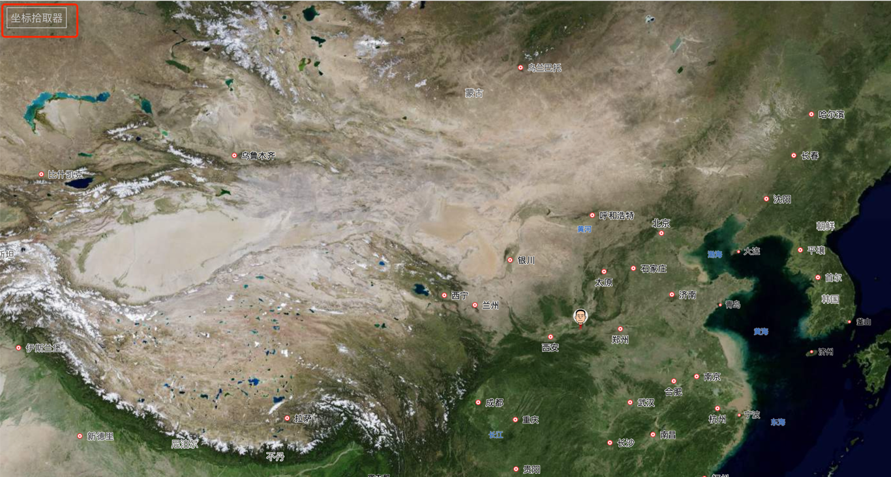

# 云墓园 (Cloud Memorial)
https://zhangxiaon.github.io/cloud-memorial/#/

## 🤝 初衷
> 思念是有方向的，亲人在哪里，思念就在哪里。一处线上纪念空间，让思念有迹可循。
> 
> 本项目旨在为无法常伴亲人墓地的人们，留下一方可寄托思念的空间。
> 
> 无需繁复操作，**一条 Issue，即是一份纪念**。

---

## 🌍 项目简介

亲人离世后，我们因生活与工作常无法长久守候。**云墓园** 提供一个轻量、开放的方式，将纪念留在网络空间：
- 每一份纪念通过 **GitHub Issue** 创建
- 包含 **标题、生平简介、照片、经纬度** 信息
- 自动呈现在地图上，以 **卫星图视角** 展示纪念地点
- 点击地图上的标记，即可查看详细信息与照片

---

## 📝 如何参与

1. 在本仓库的 [Issues](../../issues) 页面新建一条纪念信息
2. 内容需包含以下格式：

- **标题**：用以展示纪念内容
- **生平简介**：用以展示纪念内容（这里包含的图片，请直接上传到Issue）
- **照片**：使用可公开访问的链接（GitHub Issue 附件、图床等均可），仅支持一张照片
- - `lat, lng`：经纬度坐标（可以点击首页左上角坐标拾取器，获取经纬度坐标）
- 

3. 提交后，等待一分钟，页面会自动更新，在地图上生成标记点。

---

## 🗺️ 地图查看

- **首页点击标记**：查看坐标点卫星图
- **卫星图页面点击标记**：查看墓碑详情；若地区缺少卫星影像，可科学上网，选择Bing Maps补充
- **多端支持**：可在 PC 或手机端访问

---

## ⚠️ 注意事项

- 请尊重纪念对象，避免上传不当内容

